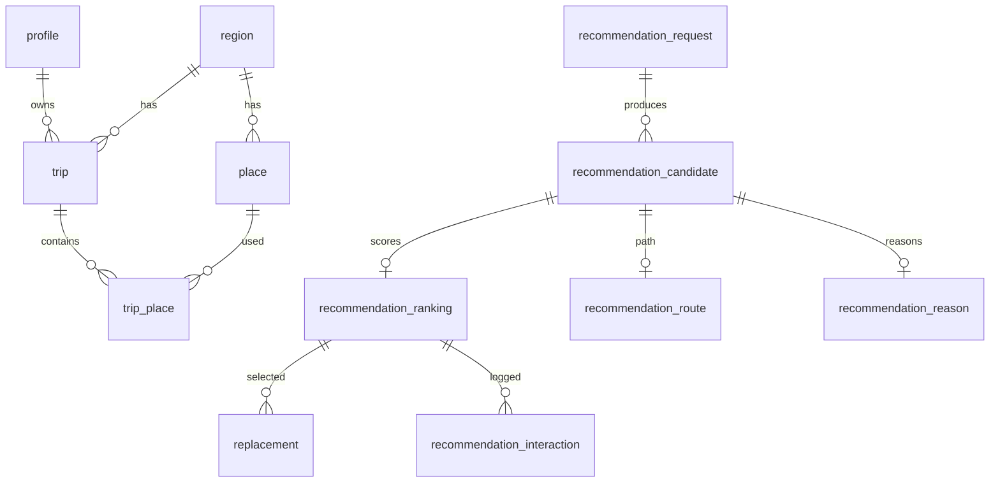

# 통합 스키마 (Part0~3)

Alembic이 **Source of Truth**. [`schema.sql`](schema.sql)은 동일 스냅샷이다.

## 파트 책임

| 파트 | 책임 |
| --- | --- |
| 공통 | `profile`, `api_fetch_log` |
| Part1 | 여행/장소/취향 |
| Part2 | 집중도 분석, 후보 생성, **점수·순위** (`recommendation_ranking`) |
| Part3 | 경로/거리, 추천 이유, 교체, 상호작용, 공유/가이드 |

## 추천 관계

```
recommendation_request
    ↓
recommendation_candidate
    ├── recommendation_ranking   (Part2: 점수/순위)  UNIQUE(candidate_id)
    ├── recommendation_route     (Part3: 경로/거리)  UNIQUE(candidate_id)
    └── recommendation_reason    (Part3: 추천/비추천 이유) UNIQUE(candidate_id)

recommendation_ranking → replacement / recommendation_interaction
```

- 실제 선택 여부: `replacement` 존재 (`reverted_at IS NULL`). `reason`에 `is_selected` 없음.
- `route_cache`: 장소 A→B API 캐시 (trip/candidate 무관)
- `recommendation_route`: candidate를 현재 trip 일정 문맥에서 평가한 결과

## 적용 방법

**A — SQL Editor**

1. public 테이블 DROP / 리셋
2. `schema.sql` 실행
3. `rls.sql` 실행
4. `alembic stamp head` (DDL 재실행 금지)

**B — Alembic**

1. public 테이블 DROP / 리셋
2. `alembic upgrade head`
3. `rls.sql` 실행

`schema.sql` 실행 후 `alembic upgrade head`를 다시 하지 말 것.

## ERD (요약)



## 확정 일정 불러오기 계약

새 테이블 없음. 최종 일정은 기존 `trip` + `trip_place` + `replacement` 로 저장한다.

| 역할 | 계약 |
| --- | --- |
| FE 화면 | `/trips/:tripId/saved` (`SavedTrip` / `SavedItineraryView`) |
| 저장 | `POST /api/trips/{tripId}/confirm` — `status=confirmed`, `confirmed_at` 설정. 이미 confirmed면 skip |
| 조회 | `GET /api/trips/{tripId}/guide` — Bearer, 소유자. 공개 공유는 `GET /api/guide/{token}` (동일 payload) |

`GET /trips/{id}/guide` 확장 필드(기존 필드 유지, camelCase):

- 일정: `regionName`, `coverImageUrl`
- stop: `stayMinutes`, `extraMinutes`, `beforeLevel`, `afterLevel` (`replacement` 의 extra_minutes / before_level / after_level)

목록 API(`GET /trips`)는 이 계약에 포함하지 않는다. 보관함/홈에서 확정 일정을 열 때 `/trips/{tripId}/saved` 로 이동하면 된다.
